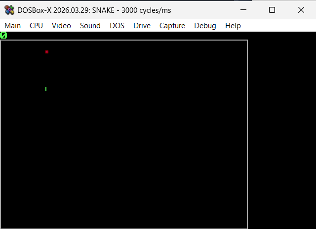

# 🐍 Snake — 8086 Assembly / MS-DOS

> *Written entirely in Assembly. No libraries. No runtime. Just registers and interrupts.*

A fully playable Snake game built from scratch in **8086 Assembly** for MS-DOS, developed as part of a Microprocessors Architecture course at [ENSI](https://ensi.rnu.tn/).

Every pixel is drawn by writing directly to VGA memory. Every random number comes from a hardware timer. Every digit on the score display goes through a hand-rolled stack-based converter. There is no standard library — the CPU does exactly what the code tells it to, nothing more.

---



---

## ⚙️ What's Actually Happening

### 🖥️ VGA Direct Write (Mode 13h)
The screen is a 320×200 pixel framebuffer mapped to memory segment `0A000h`. Drawing a pixel means computing its offset (`y × 320 + x`) and writing a color byte there with a `MOV` instruction. No GPU calls. No driver. Just memory.

### 🍎 Food Spawning with Dual Entropy Sources
Randomness in a deterministic CPU is a challenge. This game uses two sources:
- **BIOS Timer (`INT 1Ah`)** → provides the food's X coordinate  
- **PIT Channel 0 (`IN AL, 40h`)** → reads the Programmable Interval Timer directly for the Y coordinate

Two different sources = less predictable food placement.

### 💥 Collision Detection — Two Kinds
- **Wall collision**: bounds-checked against the game arena after every move  
- **Self-collision**: head coordinates compared against every body segment in a loop

### 📊 Score Display with Stack-Based Digit Extraction
The score is a raw binary byte. To display it as decimal digits, the code divides by 10 repeatedly, pushes remainders onto the x86 stack, then pops and prints them — the stack naturally reverses the digit order. Each digit is ASCII-converted with `ADD AL, 30h` before printing via `INT 10h`.

### 🎨 Reserved Score Viewport
The top 8 rows of the screen (`y < 8`) are never cleared between frames. The game arena starts at row 8, giving the score display a stable, flicker-free region.

### 🏗️ Static Arena with Drawn Walls
Boundary walls are drawn each frame by writing color `7` (grey) to the perimeter pixels of the play area, giving the game a clean bordered look.

---

## 🚀 Running the Game

### ▶️ Play Instantly

Download the pre-compiled `snake.com` from the [**Releases tab**](../../releases) and run it in [DOSBox](https://www.dosbox.com/):

```dosbox
Z:\> mount c C:\path\to\snake-8086
Z:\> c:
C:\> snake.com
```

### 🔧 Compile from Source

You need [NASM](https://www.nasm.us/) and [DOSBox](https://www.dosbox.com/).

```bash
# Clone
git clone https://github.com/YourUsername/snake-8086.git
cd snake-8086

# Assemble into a flat .com binary — one command, no linker needed
nasm -f bin src/snake_full.asm -o snake.com
```

Then mount and run in DOSBox as shown above.

---

## 🎮 Controls

| Key | Action |
|-----|--------|
| `↑` `↓` `←` `→` | Move the snake |
| `ESC` | Quit (shows Game Over screen) |

Reverse direction (e.g. going Right then pressing Left) is ignored — the snake can't double back on itself.

---

## 🗂️ Project Structure

```
snake-8086/
│
├── src/
│   └── snake_full.asm       # Complete game source (~200 lines of Assembly)
│
├── assets/
│   └── gameplay_screenshot.png
│
├── .gitignore
├── LICENSE
└── README.md
```

---

## 🏷️ Topics

`assembly` · `8086` · `x86` · `nasm` · `dosbox` · `ms-dos` · `snake-game` · `retro-gaming` · `vga` · `microprocessors` · `low-level` · `game-dev`

---

## ⚖️ License

[MIT](LICENSE) — learn from it, fork it, build on it.

---

<div align="center">
<sub>Built with <code>MOV</code>, <code>INT</code>, and a stubborn refusal to use high-level languages.</sub>
</div>